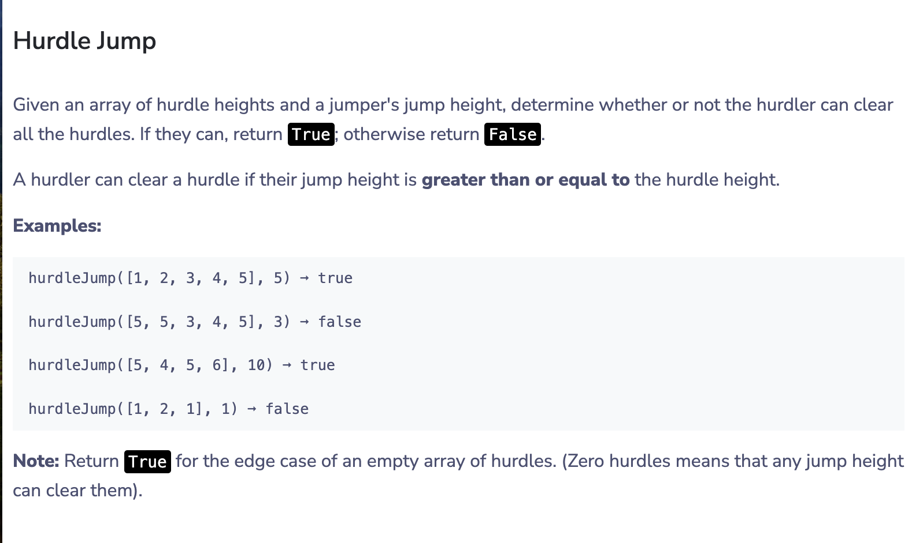

# Reading javascript using the book Laurence Lars Svekis, Maaike van Putten, Rob Percival - JavaScript from Beginner to Professional_.pdf

## Day 1 21/11/2023
### Did chapter 1-4 during the mentorship session 
### Started chapter5 today
learned about loops (while do while and for loops and nested loops).

*********

## Day 2 22/11/2023
### The solutions are found in the exercise file.
## Today i solved 2 questions since i did not have enought time and i am writing tomorrow.
here is the question for the second solution 

*********

## Day 3 & 4  29/30/11/2023
learned about break and continue statements and also how to lable a loop.

## ive also read ablout chapter 5 and things ive been to learn are console.table which is actually very fun ive learned about labelling loops nested loops loops such as while do while for loops for of lopps 

*********

## Day 5  01/12/2023

Day 5 exercise  
we can combine arrow functions with built in methods.

if we usig the forEach method a common example would be 

```
const arr = ["squirrel", "alpaca", "buddy"];
arr.forEach(e => console.log(e));
```

line 102 in chapter 6 return underfined because our function has nothing to return
if we have just one line in an arrow function that we need to return we may not use the return keyword 
example 
```
let addTwoNumbers = (x, y) => x + y;
let result = addTwoNumbers(12, 15);
console.log(result);
//27
```
but when using multiple line then we would need to inslude the return word

```
let addTwoNumbers = (x, y) => {
console.log("Adding...");
return x + y;
}
```
### What i was able to learn today
* functions
* spread operators
* rest parameters
* arrow functions
* using arrow functions and methods as demonstrated above

*********

## Day 6  03/12/2023
learned about variable scope both global and local
*********
## Day 7  04/12/2023

* learned about the difference between let var and const 
* learned about recursio
* learned about function callback, anonymous functions and  b     imediatly invoked functions ();
* did the chapter exercises
*********
### next up chapter 7 claases