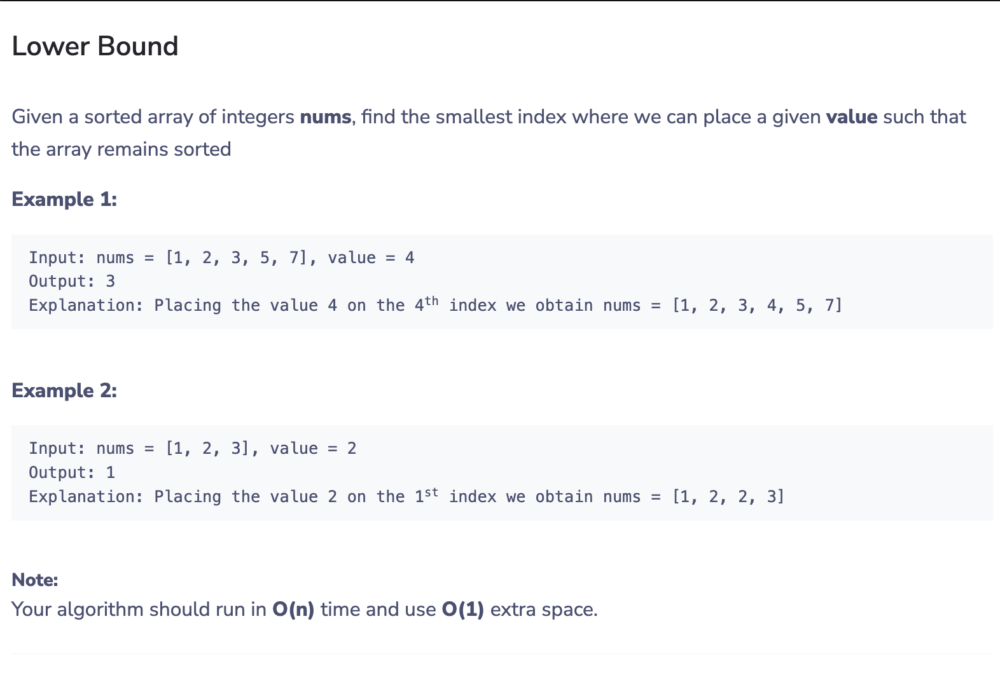

# Reading javascript using the book Laurence Lars Svekis, Maaike van Putten, Rob Percival - JavaScript from Beginner to Professional_.pdf
## Day 1 21/11/2023
### Did chapter 1-4 during the mentorship session 
### Started chapter5 today
learned about loops (while do while and for loops and nested loops).

## Day 2 22/11/2023
### The solutions are found in the exercise file.
## Today i solved 2 questions since i did not have enought time and i am writing tomorrow.
here is the question for the second solution 

