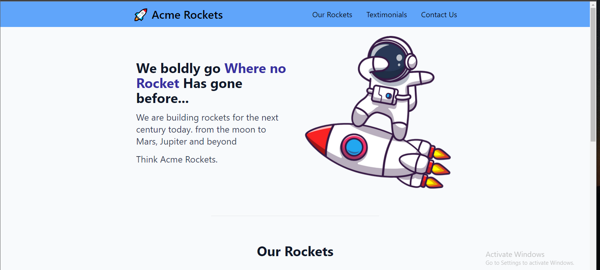
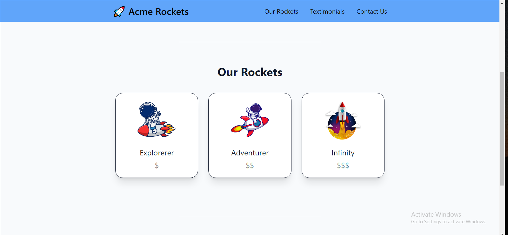

<h1>OK  so initially it was meant for learning js which I am still doing but in the form of #100days of code would change the name of the file soon</h1>
<h2>This file would contain the codes I would write for both alx and my personal learning on javascript(my 100 days of code learning journey)</h2>

I am currently taking the javascript course on @grasshopper and I learning javascript.

<h3>Day1</h3>   I completed half of the task on @grasshopper and I was able to learn about function calling, variable, if/else statements. 

<h3>Day2</h3>  I was able to finish the first part of the course which the coding fundamentals and I learned about for loops objects, for-in and for-of loops how to access an object and how to store an array as an object property.

<h3>Day3</h3>  So I started the fundamentals 2 of the grasshopper javascript and I learned about .length , and methods like include and replace and also looked at variable scopes. learned about local and global variables.

<h3>Day 4</h3>  learned a out ternary operators

<h3>Day 5</h3>  console.log and functions

<h3>Day 6</h3>  so I learn about the push pop filter foreach slice  spread operator  and also learned about helper functions parameters and arguments ONE COMPILER

<h3>day 7</h3>   learned more on functions and indexing

<h3>day 8</h3>  
learning dom manipulation on w3schools. don't have data on my pc so cant connect to Grasshopper

<h3>day 9</h3>  learned about computational thinking, while loops

<h3>Day 10</h3>  I wrote different functions that perform different stuff 

<h3>Day 11</h3>  I was able to solve one of google coding interview but I didn't quite understand parts of the code.   
<b>indexOf</b> is used to find the index of the argument passed to the method.    LastIndexOf works like indexOf just that it starts searching from the last element I the array. if ak element is not found the method returns a -1. 
<b>shift</b> method remove the first element in an array and its similar to .pop method   
<b>unshift</b> method adds element to the start of an array works like push  
<b>.reverse</b> is used to reverse a string   
<b>the splice method is used to replace elements in an array at a certain position in the array. it takes 3 parameters. the start position end position and the elements is going to replace at the specified position.</b>
<b>.join method</b> it is used to combine elements of an array into  string. it takes parameters and adds the parameter as it combines the elements of the array. if no argument is passed it automatically adds a comma(',')  
<b>.map</b> it take elements and replace them.  
<b>.reduce</b>.reduce() uses an array to calculate a single value, for example the sum.
.reduce() uses 2 arguments: a callback function, and a starting value. The callback also uses 2 parameters: the total value so far, and the current value.

<h3>Day 12</h3>  so learned about svg, event handlers

<h3>Day13</h3>  learned more on animations. how to include loops so as to make complex animation.   Also learned about debugging code and learned about the different types of errors. syntax arithmetic and logic errors.   Learned about the try ...catch statements

<h3>day 14</h3>   getElementById is used to select a specific id and returns the element matching the id.  
.textContent is used to change the text of a specific id.  the appendChild method is used to add an html element as a  child of another element.

<h3>Day 15</h3>  I continued to learn how to get element from html using javascript and I also leaarned about the appendChild element.   and also about the createElement property.  
document.createElelement('') is used to create a new element then you can use the appendChild so as to append the element in the body.  
also learned about the addEventListenner. it takes two parameter the taction to perform and also the event.

<h3>day 16</h3>   so yesterday I went to the css battle page and a friend of mine was teaching me how to solve redo some fun drawings using css and html. 

<h3>Day 17</h3>  learned about automation with appScripts. https://www.google.com/script/start/

<h3>Day 18</h3>   so for day 18 I worked on an old project which I had build already and im trying to make it more dynamic. Afro Vision 

<h3>Day 19</h3>   still worked on the project.

<h3>Day 20</h3>  I started back with my freecodecamp course so I learned about functional programming mutations and also the outcome is known as mutation

<h3>Dat 21</h3> Another principle of functional programming is to always declare your dependencies explicitly.   This means if a function depends on a variable or object being present, then pass that variable or object directly into the function as an argument.  

There are several good consequences from this principle. The function is easier to test, you know exactly what input it takes, and it won't depend on anything else in your program. 

<h3>day 22</h3> The map method iterates over each item in an array and returns a new array containing the results of calling the callback function on each element. It does this without mutating the original array.
 
When the callback is used, it is passed three arguments. The first argument is the current element being processed. 
 
The second is the index of that element and the third is the array upon which the map method was called.

<h3>Day 23</h3>  here I implemented the map function using a for loop.

<h3>day 26, 27,28</h3>   Days that I did work. but stiil related to day 25,24,23

<h3>day 29</h3>   reduce method
//The callback function accepts four arguments.   The first argument is known as the accumulator, which gets assigned the return value of the callback function from the previous iteration, the second is the current element being processed, the third is the index of that element and the fourth is the array upon which reduce is called
 
//using the reduce method to return the key and value of an obj

<h3>day 30</h3>   The sort method sorts the elements of an array according to the callback function. A side effect of the sort method is that it changes the order of the elements in the original array. In other words, it mutates the array in place

<h3>Day 31</h3>  using regular expressions and also the split method to split string in to an array of that string. also did a little revision on regulaer expressions. Also learned about the join method: which  takes an array and combines it to a string.

<h3>day 32</h3>  Apply Functional Programming to Convert Strings to URL Slugs. Use the every Method to Check that Every Element in an Array Meets a Criteria

<h3>day 33</h3>  The some method works with arrays to check if any element passes a particular test. It returns a Boolean value - true if any of the values meet the criteria, false if not. Introduction to Currying and Partial Application

<h3>Day 34</h3> starting the last module and wrote two function today
<ol>
    <li>code that takess two numbers in the array and add upto all the numbers in between them including those two numbers</li>
    <li>code that takes two  arrays and checks if there is any number found in one that is not in the other.</li>
</ol> 

<h3>Day 35</h3>  wrote 3 functions today 
<ol>
    <li>You will be provided with an initial array (the first argument in the destroyer function), followed by one or more arguments. Remove all elements from the initial array that are of the same value as these arguments.</li>
    <li>function that taks two paramters and checks if the objext found in the second argument is found in the first and returns an array containing the lements found in second argument.</li>
    <li>/Convert a string to spinal case. Spinal case is all-lowercase-words-joined-by-dashes.</li>
</ol>

<h3></h3> 

<h3></h3> 

<h3></h3> 

<h3>Day 39</h3> In this solution, we check every multiple of the largest value in the range until we find a value that is divisible by every value in the range.
 
The upper bound for this loop is the product of all values in the provided range, because this number will be divisible by every value in the range. didnt understand this code

<h3>day 40</h3> started with the certification did the roman numeral converter and also workedd on the palindrom checker also wrote  a function to reverse a string

<h3>day 41</h3> Flatten a nested array. You must account for varying levels of nesting. also wrote a code that  took a certain function as argument and an array if the elements in the array do not meet the function criteria then the elmt in the array should be cutoff starting form the left.

<h3>day 42</h3>  wrote a function that converted from binary to words useful things I learned were split join parseInt and also String. <b>fromCharCode<b> also wrote a function that takes an array of object and a property and checks if all the elements in the array that have that property are truthy or not. Create a function that sums two arguments together.  If only one argument is provided, then return a function that expects one argument and returns the sum. 

<h3>day 43</h3>  Fill in the object constructor with the following methods below:
<ul>
    <li>getFirstName()</li>
    <li>getLastName()</li>
    <li>getFullName()</li>
    <li>setFirstName(first)</li>
    <li>setLastName(last)</li>
    setFullName(firstAndLast)
</ul>
According to Kepler's Third Law, the orbital period  T of two point masses orbiting each other in a circular or elliptic orbit is:

T=2π√(a**3/μ)

<h3>day 44</h3> Did the telephone validator and a function which takes a ROT13 encoded string as input and returns a decoded string.

<h3>day 45</h3><h2><b>BREAK</b></h2>

<h3></h3>

<h3></h3>

<h3>day 48</h3>  learned about event bubling and capturing in javascript
  Learned about event capturing and bubbling.
When we use the addEventListener it takes in 3 parameters which is the action, function and also the event propagation mode. the default value is false meaning we would use bubbling to handle how the program work  

<h3>day 49</h3> nodeName is read-only
<ul><h3>nodeName is read-only<h3>
<li>nodeName of an element node is the same as the tag name</li>
<li>nodeName of an attribute node is the attribute name</li>
<li>nodeName of a text node is always #text</li>
<li>nodeName of the document node is always #document</li>
</ul>

<h3>day 50 51</h3>  I build an interface that takes in user details and print them out when requested.

<h3>day 52</h3> "here I made a card that can be used to represent people that implemented glasmorphism. its cool though :)

<h3>day 53</h3>  made a digital clock. the file that has VS at the end represents the clock numbers in two's and the one just there represent the clock numbers in one's

<h3>Day 54</h3> made a calculator

<h3>Day 55</h3> started with a music player app did the html and part of the css

<h3>day 56</h3> ok so I finished the css and started  was really tired so I commented on the html and css of the music player.

<h3>day 57</h3>  ok so now starting with JS for the music player

<h3>day 58 and 59</h3> its really fun cus I am getting to learn more. like this is the type of project I need to so as to learn

<h3>Day60</h3> 
<h1>HURRAY!!!!!!!! im at two months of coding already now we left with 40 more days </h1>
and I also finished coding my music app its so cool and I played the songs I like :)

<h3>Day61</h3>   I started attending an 3day onsite bootcamp on <h2><b>React</b></h2>

we first started with javascript today 15.06.2023

we did the following 

 <ul>
    <li>functions and objects  an object is data type that you give it other data types php we see associative arrays.</li>
    <li>we also use the "delete" so as to remove an attribute form an object.</li>
    <li> methods are like variables but they perform an operation</li>
    <li>so the "this" concept is there to tell us we want to access something within the object.</li>
    <li>we also talked abit about APIs API is a way to pull data from another website</li>
</ul>
We can have an object that takes other object like lets say we an have an atribute that takes an object as an

<h3>Day 61-63</h3> React is a library that helps you build web applications faster. it has just one page and the page is an index.html and is responsible for managing traffic to the other webpages. think about react like a component.  vite is fast and helps you build react apps.  

<h3>Day 64-65</h3>  I am starting with the course on freecodecamp frontend libraries

I need to take tweeets and post here write an article.

<h3>Day 66</h3>  reading a book known as the eloquent javascript chapter 1 

<h3>Day 67</h3> reading a book known as the eloquent javascript chapter 2 did not finish

<h3>Day 68</h3>finished with chapter 2 

<h3>day 69 - 70</h3> did fimished the bootstrap part I=on @freecode camp

<h3>Day 71 - 73</h3> read chapter3 and did the exercises

<h4>chapter 3 exercises</h4> 
<h4>Exercise 1</h4>

  The previous chapter introduced the standard function Math.min that returns its smallest argument. We can build something like that now. Write a function min that takes two arguments and returns their minimum.

<h4>Exercise 2</h4>
We’ve seen that % (the remainder operator) can be used to test whether a number is even or odd by using % 2 to see whether it’s divisible by two. Here’s another way to define whether a positive whole number is even or odd:

<ul>Zero is even.</ul>
<ul>One is odd.</ul>
<ul>For any other number N, its evenness is the same as N - 2.</ul>

Define a recursive function isEven corresponding to this description. The function should accept a single parameter (a positive, whole number) and return a Boolean.

Test it on 50 and 75. See how it behaves on -1. Why? Can you think of a way to fix this?

<h4>Exercise 3</h4>

You can get the Nth character, or letter, from a string by writing "string"[N]. The returned value will be a string containing only one character (for example, "b"). The first character has position 0, which causes the last one to be found at position string.length - 1. In other words, a two-character string has length 2, and its characters have positions 0 and 1.

Write a function countBs that takes a string as its only argument and returns a number that indicates how many uppercase “B” characters there are in the string.

Next, write a function called countChar that behaves like countBs, except it takes a second argument that indicates the character that is to be counted (rather than counting only uppercase “B” characters). Rewrite countBs to make use of this new function.

<><>

<h3>Day 74 - 76</h3> read chapter 4 and did its exercises it was tough though the exercises were hard 
  
<h4>Exercise 1</h4>

The introduction of this book alluded to the following as a nice way to compute the sum of a range of numbers:
  
console.log(sum(range(1, 10)));
Write a range function that takes two arguments, start and end, and returns an array containing all the numbers from start up to (and including) end.
 
 
Next, write a sum function that takes an array of numbers and returns the sum of these numbers. Run the example program and see whether it does indeed return 55.
 
 
As a bonus assignment, modify your range function to take an optional third argument that indicates the “step” value used when building the array. If no step is given, the elements go up by increments of one, corresponding to the old behavior. The function call range(1, 10, 2) should return [1, 3, 5, 7, 9]. Make sure it also works with negative step values so that range(5, 2, -1) produces [5, 4, 3, 2].
   
<h4>Exercise 2</h4> 
Arrays have a reverse method that changes the array by inverting the order in which its elements appear. For this exercise, write two functions, reverseArray and reverseArrayInPlace. The first, reverseArray, takes an array as argument and produces a new array that has the same elements in the inverse order. The second, reverseArrayInPlace, does what the reverse method does: it modifies the array given as argument by reversing its elements. Neither may use the standard reverse method.
  
<h4>Exercise 3</h4>  

Objects, as generic blobs of values, can be used to build all sorts of data structures. A common data structure is the list (not to be confused with array). A list is a nested set of objects, with the first object holding a reference to the second, the second to the third, and so on.

<h4>Exercise 4</h4>  

The == operator compares objects by identity. But sometimes you’d prefer to compare the values of their actual properties.

Write a function deepEqual that takes two values and returns true only if they are the same value or are objects with the same properties, where the values of the properties are equal when compared with a recursive call to deepEqual.

To find out whether values should be compared directly (use the === operator for that) or have their properties compared, you can use the typeof operator. If it produces "object" for both values, you should do a deep comparison. But you have to take one silly exception into account: because of a historical accident, typeof null also produces "object".

The Object.keys function will be useful when you need to go over the properties of objects to compare them.
   

<h3>Day 76 - 78</h3> read chapter 5 and did the exercises
   
<4h>exercise 1</h4>

Use the reduce method in combination with the concat method to “flatten” an array of arrays into a single array that has all the elements of the original arrays.
   
<4h>exercise 2</h4>

Write a higher-order function loop that provides something like a for loop statement. It takes a value, a test function, an update function, and a bo8dy function. Each iteration, it first runs the test function on the current loop value and stops if that returns false. Then it calls the body function, giving it the current value. Finally, it calls the update function to create a new value and starts from the beginning.

When defining the function, you can use a regular loop to do the actual looping.

   
<4h>exercise 3</h4>

Analogous to the some method, arrays also have an every method. This one returns true when the given function returns true for every element in the array. In a way, some is a version of the || operator that acts on arrays, and every is like the && operator.  
Implement every as a function that takes an array and a predicate function as parameters. Write two versions, one using a loop and one using the some method.
   
<4h>exercise 4</h4>

Write a function that computes the dominant writing direction in a string of text. Remember that each script object has a direction property that can be "ltr" (left to right), "rtl" (right to left), or "ttb" (top to bottom).

The dominant direction is the direction of a majority of the characters that have a script associated with them. 

<h3>Day 78 - 80</h3> I was able to read about chapter 6 that talked about Encapsulation, Symbols, Methods, classes, polymorphism, getters, setters and prototypes.   I was not able to do the exercises.

<h3>Day 81</h3> So today I did the set tup to start learning tailwindcss I would be using @yesdavidgrey(twitter name) on youtube.

<h3>Day 82</h3>
 
So today I started the tutorial and then I did some cool stuff
    
this image was made as the first tutorial I am following.

    
     
this images are for the second tutorial we building the ACME rocket website

    
    
    
Didnt finish the tutorial though.

<h3>Day 83</h3> 
